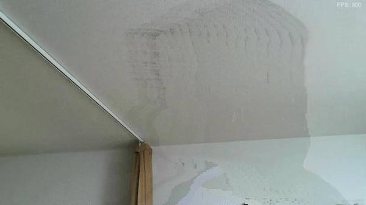

Program to remove human from camera input video.

This demo is using Barracuda + ML model distributed on [this GitHub repo](https://github.com/PINTO0309/PINTO_model_zoo).

Additionally, I learned a lot from [this repo](https://github.com/creativeIKEP/SelfieSegmentationBarracuda) and brought some code from that repo. Thank you :)
- I used the preprocess compute shader from the repository.
- I refered the C# code in the repository but the most of the part is re-written by myself.
- The combine compute shader is my original.

License: Free to use / modifiy / redistribute. But please follow the license of the ML model (MIT License).